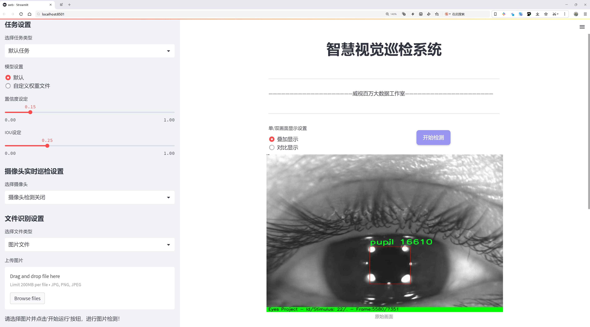
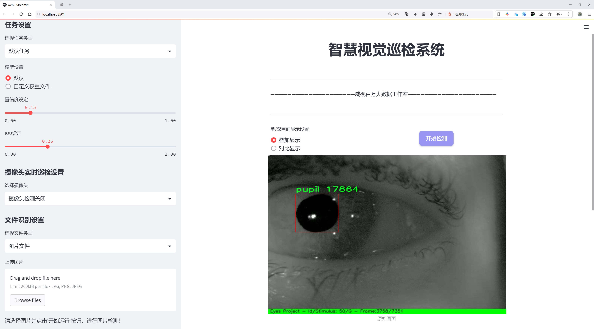
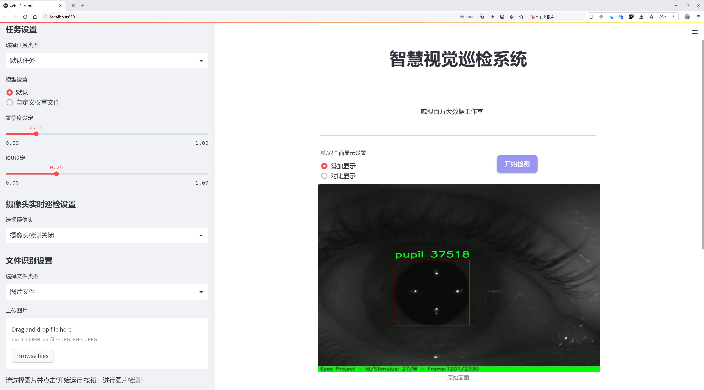
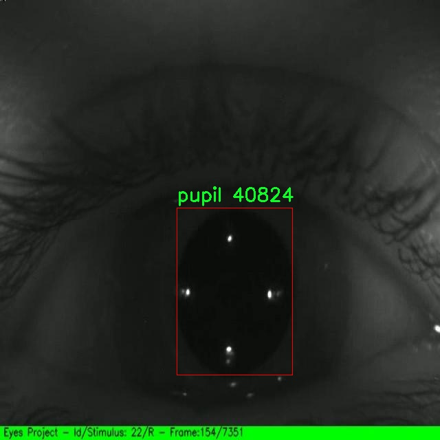
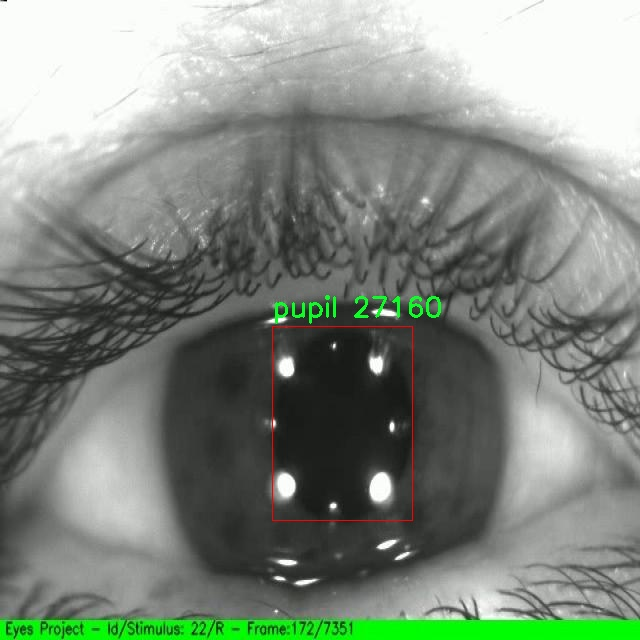
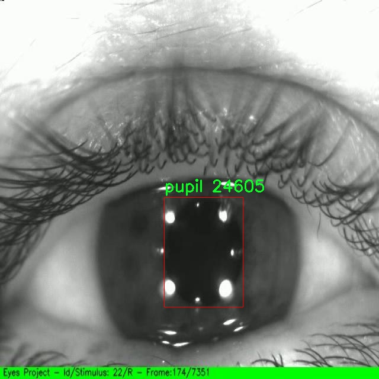
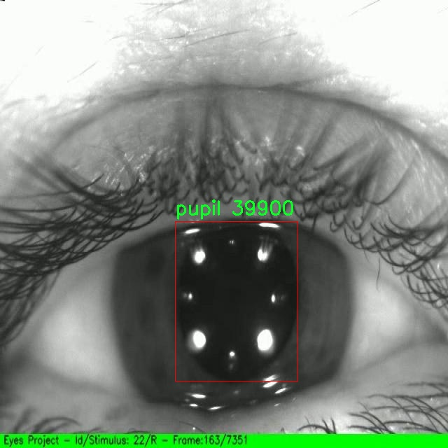
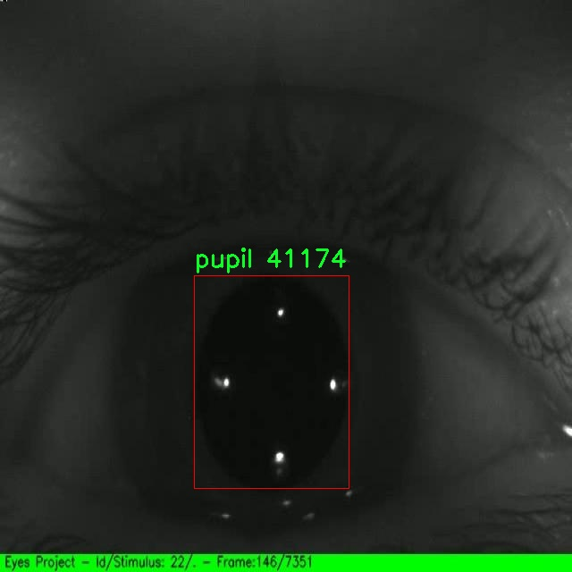

# 瞳孔检测检测系统源码分享
 # [一条龙教学YOLOV8标注好的数据集一键训练_70+全套改进创新点发刊_Web前端展示]

### 1.研究背景与意义

项目参考[AAAI Association for the Advancement of Artificial Intelligence](https://gitee.com/qunshansj/projects)

项目来源[AACV Association for the Advancement of Computer Vision](https://gitee.com/qunmasj/projects)

研究背景与意义

随着计算机视觉技术的迅速发展，物体检测在多个领域中得到了广泛应用，尤其是在医疗、安防和人机交互等领域。瞳孔检测作为一种重要的生物特征识别技术，近年来受到了越来越多的关注。瞳孔不仅是人眼的重要组成部分，其变化也能反映出个体的生理和心理状态。因此，开发高效、准确的瞳孔检测系统，对于实现智能监控、情绪识别、以及眼部健康监测等应用具有重要的现实意义。

在众多的物体检测算法中，YOLO（You Only Look Once）系列因其高效性和实时性而备受青睐。YOLOv8作为该系列的最新版本，结合了深度学习的先进技术，具备了更高的检测精度和更快的处理速度。然而，尽管YOLOv8在多种物体检测任务中表现优异，但在特定应用场景下，尤其是针对瞳孔这一小而复杂的目标，其检测性能仍有待提升。因此，基于改进YOLOv8的瞳孔检测系统的研究，旨在通过优化模型结构和训练策略，提升其在瞳孔检测任务中的准确性和鲁棒性。

本研究所使用的数据集包含了10,000张眼睛图像，专注于瞳孔这一单一类别的检测。该数据集的规模和专一性为模型的训练提供了丰富的样本，能够有效地提高模型对瞳孔特征的学习能力。此外，数据集的多样性（如不同光照条件、角度和个体差异）将有助于模型在实际应用中的泛化能力。通过对该数据集的深入分析与处理，研究者可以挖掘出更具代表性的特征，从而为改进YOLOv8提供有力的支持。

本研究的意义不仅在于提升瞳孔检测的技术水平，更在于推动相关领域的应用发展。随着智能设备的普及，基于视觉的生物特征识别技术逐渐成为人机交互的重要组成部分。高效的瞳孔检测系统可以为虚拟现实、增强现实等新兴技术提供更为精准的用户行为分析，进而提升用户体验。此外，在医疗健康领域，瞳孔检测能够为眼科疾病的早期诊断提供辅助工具，帮助医生及时发现潜在的健康问题。

综上所述，基于改进YOLOv8的瞳孔检测系统的研究，具有重要的理论价值和实际应用意义。通过优化算法和利用丰富的数据集，本研究不仅能够推动瞳孔检测技术的发展，还将为相关领域的创新应用提供新的思路和方法。随着研究的深入，期待能够在未来的工作中实现更高效、更智能的瞳孔检测系统，为社会的进步与发展贡献力量。

### 2.图片演示







##### 注意：由于此博客编辑较早，上面“2.图片演示”和“3.视频演示”展示的系统图片或者视频可能为老版本，新版本在老版本的基础上升级如下：（实际效果以升级的新版本为准）

  （1）适配了YOLOV8的“目标检测”模型和“实例分割”模型，通过加载相应的权重（.pt）文件即可自适应加载模型。

  （2）支持“图片识别”、“视频识别”、“摄像头实时识别”三种识别模式。

  （3）支持“图片识别”、“视频识别”、“摄像头实时识别”三种识别结果保存导出，解决手动导出（容易卡顿出现爆内存）存在的问题，识别完自动保存结果并导出到tempDir中。

  （4）支持Web前端系统中的标题、背景图等自定义修改，后面提供修改教程。

  另外本项目提供训练的数据集和训练教程,暂不提供权重文件（best.pt）,需要您按照教程进行训练后实现图片演示和Web前端界面演示的效果。

### 3.视频演示

[3.1 视频演示](https://www.bilibili.com/video/BV17v4UetECq/)

### 4.数据集信息展示

##### 4.1 本项目数据集详细数据（类别数＆类别名）

nc: 1
names: ['pupil']


##### 4.2 本项目数据集信息介绍

数据集信息展示

在本研究中，我们使用了名为“Eyes Pupil Detection”的数据集，旨在改进YOLOv8的瞳孔检测系统。该数据集专注于瞳孔的检测与识别，具有高度的专业性和针对性，能够为深度学习模型提供必要的训练和验证数据。数据集的类别数量为1，具体类别为“pupil”，这意味着所有的标注数据均围绕着瞳孔这一单一目标展开。这种专一性使得模型在学习过程中能够更加集中于瞳孔的特征提取与分类，从而提高检测的准确性和效率。

“Eyes Pupil Detection”数据集的构建经过精心设计，包含了多种不同的瞳孔图像，这些图像来自于不同的个体、不同的光照条件以及不同的视角。这种多样性确保了模型在训练过程中能够接触到丰富的样本，进而提升其在实际应用中的泛化能力。数据集中包含的图像不仅涵盖了正常状态下的瞳孔，还包括了在不同情绪、不同健康状态下的瞳孔表现。这种多样化的样本使得模型能够学习到更为复杂的瞳孔特征，进而提高其在复杂环境下的检测能力。

在数据集的标注过程中，采用了高精度的标注工具，确保每一张图像中的瞳孔位置和形状都得到了准确的标记。这种高质量的标注对于训练深度学习模型至关重要，因为标注的准确性直接影响到模型的学习效果和最终的检测性能。此外，数据集还经过了严格的质量控制，剔除了模糊、重复或不相关的图像，确保最终使用的数据集具备高质量和高可靠性。

为了便于研究人员和开发者使用，数据集提供了详细的文档，说明了数据集的构成、使用方法以及潜在的应用场景。这些信息不仅帮助用户快速上手，还能激发更多的研究思路和应用创新。通过对“Eyes Pupil Detection”数据集的深入分析，研究人员可以更好地理解瞳孔检测的挑战与机遇，从而推动相关领域的技术进步。

在实际应用中，改进后的YOLOv8瞳孔检测系统将能够在实时监测、医疗诊断、心理健康评估等多个领域发挥重要作用。通过对“Eyes Pupil Detection”数据集的训练，模型将具备更强的鲁棒性和准确性，能够在各种复杂环境中有效识别和定位瞳孔。这不仅为科学研究提供了新的工具，也为实际应用带来了更多的可能性。

综上所述，“Eyes Pupil Detection”数据集为改进YOLOv8的瞳孔检测系统提供了坚实的基础，凭借其高质量的标注和丰富的样本，研究人员能够在此基础上开展深入的研究与探索，为瞳孔检测技术的发展贡献力量。











### 5.全套项目环境部署视频教程（零基础手把手教学）

[5.1 环境部署教程链接（零基础手把手教学）](https://www.ixigua.com/7404473917358506534?logTag=c807d0cbc21c0ef59de5)


[5.2 安装Python虚拟环境创建和依赖库安装视频教程链接（零基础手把手教学）](https://www.ixigua.com/7404474678003106304?logTag=1f1041108cd1f708b01a)

### 6.手把手YOLOV8训练视频教程（零基础小白有手就能学会）

[6.1 手把手YOLOV8训练视频教程（零基础小白有手就能学会）](https://www.ixigua.com/7404477157818401292?logTag=d31a2dfd1983c9668658)

### 7.70+种全套YOLOV8创新点代码加载调参视频教程（一键加载写好的改进模型的配置文件）

[7.1 70+种全套YOLOV8创新点代码加载调参视频教程（一键加载写好的改进模型的配置文件）](https://www.ixigua.com/7404478314661806627?logTag=29066f8288e3f4eea3a4)

### 8.70+种全套YOLOV8创新点原理讲解（非科班也可以轻松写刊发刊，V10版本正在科研待更新）

由于篇幅限制，每个创新点的具体原理讲解就不一一展开，具体见下列网址中的创新点对应子项目的技术原理博客网址【Blog】：


[8.1 70+种全套YOLOV8创新点原理讲解链接](https://gitee.com/qunmasj/good)

### 9.系统功能展示（检测对象为举例，实际内容以本项目数据集为准）

图9.1.系统支持检测结果表格显示

  图9.2.系统支持置信度和IOU阈值手动调节

  图9.3.系统支持自定义加载权重文件best.pt(需要你通过步骤5中训练获得)

  图9.4.系统支持摄像头实时识别

  图9.5.系统支持图片识别

  图9.6.系统支持视频识别

  图9.7.系统支持识别结果文件自动保存

  图9.8.系统支持Excel导出检测结果数据


### 10.原始YOLOV8算法原理

原始YOLOv8算法原理

YOLOv8算法是由Ultralytics公司于2023年推出的最新一代目标检测模型，标志着YOLO系列算法的又一次重大进步。与之前的版本相比，YOLOv8在模型架构、特征提取、目标检测等多个方面进行了创新和优化，旨在提高目标检测的准确性和速度。YOLOv8的核心架构由三个主要部分组成：Backbone、Neck和Head，每个部分在整个模型的性能中都扮演着至关重要的角色。

在Backbone部分，YOLOv8采用了一系列卷积和反卷积层，结合残差连接和瓶颈结构，以有效提取输入图像的特征。该部分的设计使用了C2模块作为基本构成单元，显著提升了特征提取的效率。具体而言，Backbone由五个CBS模块、四个C2f模块和一个快速空间金字塔池化（SPPF）模块组成。C2f模块的引入替代了YOLOv5中的C3模块，通过将输入特征图分为两个分支并分别进行卷积操作，极大地增强了模型的特征表达能力。每个分支的输出再通过卷积层进行融合，形成更高维度的特征图，从而提升了模型的梯度流信息。这种结构不仅减小了模型的大小，还提高了其性能，使得YOLOv8在特征提取上具备了更强的能力。

接下来是Neck部分，YOLOv8采用了多尺度特征融合技术，以便更好地捕捉不同尺度目标的信息。Neck的设计灵感来源于特征金字塔网络（FPN）和路径聚合网络（PAN），通过对来自Backbone不同阶段的特征图进行融合，增强了模型对多尺度目标的检测能力。这种特征融合方式有效提高了目标检测的性能和鲁棒性，使得YOLOv8能够在复杂场景中更准确地识别和定位目标。

最后是Head部分，负责最终的目标检测和分类任务。YOLOv8的Head设计包含三个检测头，分别用于处理不同尺寸的信息。这些检测头通过一系列卷积层和反卷积层生成最终的检测结果。值得注意的是，YOLOv8采用了无锚框（Anchor-Free）的检测方式，直接预测目标的中心点和宽高比例，这一创新极大地减少了对Anchor框的依赖，提高了检测速度和准确度。相较于传统的锚框方法，无锚框检测方式简化了模型的设计，降低了计算复杂度，使得YOLOv8在实际应用中更加高效。

YOLOv8的网络结构还包括多种不同规模的版本，如YOLOv8n、YOLOv8s、YOLOv8m、YOLOv8l和YOLOv8x，这些版本的主要区别在于Backbone的层数和残差块的数量。每种版本都针对不同的应用场景进行了优化，用户可以根据实际需求选择合适的模型进行训练和部署。这种灵活性使得YOLOv8在目标检测领域具备了更广泛的适用性。

总的来说，YOLOv8算法通过对Backbone、Neck和Head的精心设计，结合了现代深度学习的多项先进技术，显著提升了目标检测的性能。其高效的特征提取、灵活的多尺度特征融合以及无锚框的检测方式，使得YOLOv8在复杂场景下的目标检测能力得到了质的飞跃。随着YOLOv8的推出，目标检测技术的应用范围将进一步扩大，推动智能监控、自动驾驶、无人机等领域的发展。


### 11.项目核心源码讲解（再也不用担心看不懂代码逻辑）

#### 11.1 code\log.py

以下是对代码的核心部分进行的分析和详细注释：

```python
import os
import time
import cv2
import pandas as pd
from PIL import Image

def save_chinese_image(file_path, image_array):
    """
    保存带有中文路径的图片文件

    参数：
    file_path (str): 图片的保存路径，应包含中文字符, 例如 '示例路径/含有中文的文件名.png'
    image_array (numpy.ndarray): 要保存的 OpenCV 图像（即 numpy 数组）
    """
    try:
        # 将 OpenCV 图片转换为 Pillow Image 对象
        image = Image.fromarray(cv2.cvtColor(image_array, cv2.COLOR_BGR2RGB))

        # 使用 Pillow 保存图片文件
        image.save(file_path)

        print(f"成功保存图像到: {file_path}")
    except Exception as e:
        print(f"保存图像失败: {str(e)}")

class ResultLogger:
    def __init__(self):
        """
        初始化ResultLogger类。
        """
        # 创建一个空的DataFrame用于存储识别结果
        self.results_df = pd.DataFrame(columns=["识别结果", "位置", "面积", "时间"])

    def concat_results(self, result, location, confidence, time):
        """
        显示检测结果，并将结果添加到结果DataFrame中。

        参数：
            result (str): 检测结果。
            location (str): 检测位置。
            confidence (str): 置信度。
            time (str): 检出目标所在时间。

        返回：
            pd.DataFrame: 更新后的DataFrame。
        """
        # 创建一个包含这些信息的字典
        result_data = {
            "识别结果": [result],
            "位置": [location],
            "面积": [confidence],
            "时间": [time]
        }

        # 创建一个新的DataFrame并将其添加到实例的DataFrame
        new_row = pd.DataFrame(result_data)
        self.results_df = pd.concat([self.results_df, new_row], ignore_index=True)

        return self.results_df

class LogTable:
    def __init__(self, csv_file_path=None):
        """
        初始化类实例。

        参数：
            csv_file_path (str): 保存初始数据的CSV文件路径。
        """
        self.csv_file_path = csv_file_path
        self.data = pd.DataFrame(columns=['文件路径', '识别结果', '位置', '面积', '时间'])

        # 尝试从CSV文件加载数据，如果失败则创建一个空的DataFrame
        if csv_file_path and os.path.exists(csv_file_path):
            self.data = pd.read_csv(csv_file_path, encoding='utf-8')

    def add_log_entry(self, file_path, recognition_result, position, confidence, time_spent):
        """
        向日志中添加一条新记录。

        参数：
            file_path (str): 文件路径
            recognition_result (str): 识别结果
            position (str): 位置
            confidence (float): 置信度
            time_spent (float): 用时（通常是秒或毫秒）

        返回：
            None
        """
        # 创建新的数据行
        new_entry = pd.DataFrame([[file_path, recognition_result, position, confidence, time_spent]],
                                 columns=['文件路径', '识别结果', '位置', '面积', '时间'])

        # 将新行添加到DataFrame中
        self.data = pd.concat([new_entry, self.data]).reset_index(drop=True)

    def save_to_csv(self):
        """
        将更新后的DataFrame保存到CSV文件。
        """
        self.data.to_csv(self.csv_file_path, index=False, encoding='utf-8', mode='a', header=False)

    def update_table(self, log_table_placeholder):
        """
        更新表格，显示最新的500条记录。

        参数：
            log_table_placeholder: Streamlit的表格占位符

        返回：
            None
        """
        # 判断DataFrame的长度是否超过500
        if len(self.data) > 500:
            # 如果超过500，仅显示最新的500条记录
            display_data = self.data.head(500)
        else:
            # 如果不超过，显示全部数据
            display_data = self.data

        log_table_placeholder.table(display_data)
```

### 核心部分分析

1. **保存带有中文路径的图片**：
   - `save_chinese_image` 函数负责将图像保存到指定路径，支持中文路径。使用 `Pillow` 库处理图像格式转换。

2. **结果记录器**：
   - `ResultLogger` 类用于记录检测结果，包括识别结果、位置、面积和时间。通过 `concat_results` 方法将新的结果添加到 `DataFrame` 中。

3. **日志表**：
   - `LogTable` 类用于管理日志数据，支持从 CSV 文件加载数据，添加新记录，并将数据保存回 CSV 文件。`add_log_entry` 方法用于添加新的日志条目，`save_to_csv` 方法用于保存数据。

4. **更新表格**：
   - `update_table` 方法用于更新表格显示，确保只显示最新的500条记录，适用于数据量较大的情况。

这些核心部分构成了一个图像处理和结果记录的基础框架，适用于需要保存和管理图像识别结果的应用场景。

这个文件 `log.py` 是一个用于处理图像和记录检测结果的 Python 脚本，主要依赖于 OpenCV、Pandas 和 Pillow 等库。文件中定义了几个重要的功能，包括保存带有中文路径的图像、记录检测结果以及将这些结果保存到 CSV 文件中。

首先，脚本中定义了一个 `save_chinese_image` 函数，用于保存包含中文字符的文件路径的图像。该函数接收两个参数：文件路径和图像数组。它首先将 OpenCV 格式的图像转换为 Pillow 图像对象，然后尝试保存图像。如果保存成功，会打印成功信息；如果失败，则捕获异常并打印错误信息。

接下来，定义了一个 `ResultLogger` 类，该类用于记录检测结果。初始化时，它创建一个空的 Pandas DataFrame，包含四个列：识别结果、位置、面积和时间。`concat_results` 方法用于将新的检测结果添加到 DataFrame 中。该方法接收检测结果、位置、置信度和时间作为参数，并将这些信息封装成一个字典，创建新的 DataFrame 行并合并到现有的 DataFrame 中。

然后是 `LogTable` 类，它负责管理日志记录和图像保存。初始化时，它尝试从指定的 CSV 文件加载数据，如果文件不存在，则创建一个新的空 DataFrame。该类提供了多个方法，包括 `add_frames` 用于添加图像和检测信息，`clear_frames` 用于清空保存的图像和结果，`save_frames_file` 用于将保存的图像保存为单张图片或视频文件，`add_log_entry` 用于向日志中添加新记录，`clear_data` 用于清空 DataFrame，`save_to_csv` 用于将 DataFrame 保存到 CSV 文件中，以及 `update_table` 用于更新表格显示最新的记录。

总的来说，这个文件的功能主要集中在图像处理和结果记录上，适合用于需要记录和保存检测结果的计算机视觉应用。通过使用 Pandas 进行数据管理，能够方便地对检测结果进行存储和后续分析。

#### 11.2 ui.py

```python
import sys
import subprocess

def run_script(script_path):
    """
    使用当前 Python 环境运行指定的脚本。

    Args:
        script_path (str): 要运行的脚本路径

    Returns:
        None
    """
    # 获取当前 Python 解释器的路径
    python_path = sys.executable

    # 构建运行命令，使用 streamlit 运行指定的脚本
    command = f'"{python_path}" -m streamlit run "{script_path}"'

    # 执行命令
    result = subprocess.run(command, shell=True)
    # 检查命令执行的返回码，如果不为0则表示出错
    if result.returncode != 0:
        print("脚本运行出错。")

# 实例化并运行应用
if __name__ == "__main__":
    # 指定要运行的脚本路径
    script_path = "web.py"  # 这里可以直接使用相对路径

    # 调用函数运行脚本
    run_script(script_path)
```

### 代码核心部分及注释说明：

1. **导入模块**：
   - `import sys`：用于访问与 Python 解释器相关的变量和函数。
   - `import subprocess`：用于执行外部命令。

2. **定义 `run_script` 函数**：
   - 该函数接收一个脚本路径作为参数，并在当前 Python 环境中运行该脚本。

3. **获取 Python 解释器路径**：
   - `python_path = sys.executable`：获取当前正在使用的 Python 解释器的完整路径。

4. **构建命令**：
   - `command = f'"{python_path}" -m streamlit run "{script_path}"'`：构建要执行的命令，使用 `streamlit` 模块运行指定的脚本。

5. **执行命令**：
   - `result = subprocess.run(command, shell=True)`：使用 `subprocess.run` 执行构建的命令，并将结果存储在 `result` 中。

6. **检查返回码**：
   - `if result.returncode != 0:`：检查命令的返回码，如果不为0，表示脚本运行出错，打印错误信息。

7. **主程序入口**：
   - `if __name__ == "__main__":`：确保该部分代码仅在直接运行脚本时执行。
   - `script_path = "web.py"`：指定要运行的脚本路径。
   - `run_script(script_path)`：调用 `run_script` 函数以运行指定的脚本。

这个程序文件名为 `ui.py`，其主要功能是通过当前的 Python 环境来运行一个指定的脚本，具体是使用 Streamlit 来启动一个 Web 应用。

首先，程序导入了必要的模块，包括 `sys`、`os` 和 `subprocess`。其中，`sys` 模块用于访问与 Python 解释器相关的变量和函数，`os` 模块提供了与操作系统交互的功能，而 `subprocess` 模块则用于创建新进程、连接到它们的输入/输出/错误管道，并获取它们的返回码。

接着，程序从 `QtFusion.path` 模块中导入了 `abs_path` 函数，这个函数的作用是获取给定路径的绝对路径。

在 `run_script` 函数中，程序接受一个参数 `script_path`，表示要运行的脚本的路径。函数首先获取当前 Python 解释器的路径，并将其存储在 `python_path` 变量中。然后，构建一个命令字符串，该命令使用 Streamlit 来运行指定的脚本。命令的格式是 `"{python_path}" -m streamlit run "{script_path}"`，这意味着使用当前的 Python 解释器来执行 Streamlit 模块，并运行传入的脚本。

随后，程序使用 `subprocess.run` 方法来执行构建好的命令，并通过 `shell=True` 参数在 shell 中运行它。执行完命令后，程序检查返回码，如果返回码不为 0，表示脚本运行出错，程序会打印出相应的错误信息。

在文件的最后部分，程序通过 `if __name__ == "__main__":` 语句来判断是否直接运行该脚本。如果是，程序会调用 `abs_path` 函数来获取 `web.py` 脚本的绝对路径，并将其存储在 `script_path` 变量中。最后，调用 `run_script` 函数来运行这个脚本。

总体来说，这个程序的目的是为了方便地通过 Python 环境启动一个 Streamlit Web 应用，提供了一种简单的方式来运行指定的 Python 脚本。

#### 11.3 code\ultralytics\utils\instance.py

以下是经过简化和注释的核心代码部分，主要集中在 `Bboxes` 和 `Instances` 类的实现上。注释详细解释了每个方法和属性的功能。

```python
import numpy as np

class Bboxes:
    """
    处理边界框的类，支持多种格式（'xyxy', 'xywh', 'ltwh'）。
    属性:
        bboxes (numpy.ndarray): 存储边界框的二维数组。
        format (str): 边界框的格式（'xyxy', 'xywh', 或 'ltwh'）。
    """

    def __init__(self, bboxes, format="xyxy") -> None:
        """初始化 Bboxes 类，接受边界框数据和格式。"""
        assert format in ["xyxy", "xywh", "ltwh"], f"无效的边界框格式: {format}"
        bboxes = bboxes[None, :] if bboxes.ndim == 1 else bboxes  # 确保 bboxes 是二维的
        assert bboxes.ndim == 2 and bboxes.shape[1] == 4, "边界框必须是二维数组，且每个框包含4个值"
        self.bboxes = bboxes
        self.format = format

    def convert(self, format):
        """将边界框格式转换为指定的格式。"""
        assert format in ["xyxy", "xywh", "ltwh"], f"无效的边界框格式: {format}"
        if self.format == format:
            return  # 如果格式相同，不做任何操作
        # 根据当前格式和目标格式选择转换函数
        func = {
            "xyxy": (xyxy2xywh if format == "xywh" else xyxy2ltwh),
            "xywh": (xywh2xyxy if format == "xyxy" else xywh2ltwh),
            "ltwh": (ltwh2xyxy if format == "xyxy" else ltwh2xywh)
        }[self.format]
        self.bboxes = func(self.bboxes)  # 执行转换
        self.format = format  # 更新格式

    def areas(self):
        """计算并返回每个边界框的面积。"""
        self.convert("xyxy")  # 确保转换为 'xyxy' 格式
        return (self.bboxes[:, 2] - self.bboxes[:, 0]) * (self.bboxes[:, 3] - self.bboxes[:, 1])  # 计算面积

    def __len__(self):
        """返回边界框的数量。"""
        return len(self.bboxes)

class Instances:
    """
    存储图像中检测到的对象的边界框、分段和关键点的容器。
    属性:
        _bboxes (Bboxes): 处理边界框操作的内部对象。
        keypoints (ndarray): 关键点数组，形状为 [N, 17, 3]。
        segments (ndarray): 分段数组，形状为 [N, 1000, 2]。
    """

    def __init__(self, bboxes, segments=None, keypoints=None, bbox_format="xywh", normalized=True) -> None:
        """初始化 Instances 类，接受边界框、分段和关键点数据。"""
        self._bboxes = Bboxes(bboxes=bboxes, format=bbox_format)  # 创建 Bboxes 对象
        self.keypoints = keypoints
        self.normalized = normalized
        self.segments = segments

    def convert_bbox(self, format):
        """转换边界框格式。"""
        self._bboxes.convert(format=format)

    @property
    def bbox_areas(self):
        """计算边界框的面积。"""
        return self._bboxes.areas()

    def scale(self, scale_w, scale_h, bbox_only=False):
        """缩放边界框、分段和关键点的坐标。"""
        self._bboxes.mul(scale=(scale_w, scale_h, scale_w, scale_h))  # 缩放边界框
        if not bbox_only:  # 如果不只缩放边界框
            self.segments[..., 0] *= scale_w
            self.segments[..., 1] *= scale_h
            if self.keypoints is not None:
                self.keypoints[..., 0] *= scale_w
                self.keypoints[..., 1] *= scale_h

    def __getitem__(self, index) -> "Instances":
        """使用索引获取特定实例或一组实例。"""
        segments = self.segments[index] if len(self.segments) else self.segments
        keypoints = self.keypoints[index] if self.keypoints is not None else None
        bboxes = self._bboxes[index]
        bbox_format = self._bboxes.format
        return Instances(bboxes=bboxes, segments=segments, keypoints=keypoints, bbox_format=bbox_format, normalized=self.normalized)

    def __len__(self):
        """返回实例的数量。"""
        return len(self._bboxes)
```

### 代码说明：
1. **Bboxes 类**：
   - 用于处理边界框，支持多种格式（'xyxy', 'xywh', 'ltwh'）。
   - 提供了初始化、格式转换、面积计算等功能。

2. **Instances 类**：
   - 用于存储图像中检测到的对象的边界框、分段和关键点。
   - 提供了缩放、格式转换、索引访问等功能。

通过这些核心部分和注释，可以清晰地理解代码的结构和功能。

这个程序文件定义了两个主要的类：`Bboxes`和`Instances`，用于处理计算机视觉中的边界框（bounding boxes）及其相关信息。文件中包含了多种边界框格式的转换和操作，支持的格式包括`xyxy`、`xywh`和`ltwh`。

首先，`Bboxes`类用于管理边界框数据。它的构造函数接受一个边界框数组和格式参数，确保输入的格式有效，并且将边界框数据存储为一个二维的NumPy数组。类中提供了多种方法来转换边界框格式、计算面积、缩放和偏移边界框等操作。特别地，`convert`方法可以在不同格式之间进行转换，`areas`方法计算每个边界框的面积，`mul`和`add`方法分别用于缩放和偏移边界框的坐标。

`Instances`类则是一个更高层次的容器，除了包含边界框信息外，还可以存储物体的关键点和分割信息。它的构造函数接受边界框、分割和关键点数据，并将边界框数据封装为`Bboxes`对象。该类同样提供了方法来转换边界框格式、缩放、归一化和去除零面积的边界框。`flipud`和`fliplr`方法可以实现上下和左右翻转边界框及其相关信息。

此外，两个类都实现了索引功能，允许通过索引访问特定的边界框或实例。`concatenate`类方法则用于将多个`Bboxes`或`Instances`对象合并为一个新的对象。

总体而言，这个文件提供了一套完整的工具，用于处理和操作边界框数据，适用于目标检测和图像分割等计算机视觉任务。

#### 11.4 70+种YOLOv8算法改进源码大全和调试加载训练教程（非必要）\ultralytics\utils\callbacks\wb.py

以下是经过简化和注释的核心代码部分：

```python
# 导入必要的库
from ultralytics.utils import SETTINGS, TESTS_RUNNING
from ultralytics.utils.torch_utils import model_info_for_loggers

# 尝试导入wandb库并进行基本的设置检查
try:
    assert not TESTS_RUNNING  # 确保当前不是测试运行
    assert SETTINGS['wandb'] is True  # 确保wandb集成已启用
    import wandb as wb

    assert hasattr(wb, '__version__')  # 确保wandb包已正确导入

    import numpy as np
    import pandas as pd

    _processed_plots = {}  # 用于记录已处理的图表

except (ImportError, AssertionError):
    wb = None  # 如果导入失败，设置wb为None


def _custom_table(x, y, classes, title='Precision Recall Curve', x_title='Recall', y_title='Precision'):
    """
    创建并记录自定义的精确度-召回率曲线可视化。

    参数:
        x (List): x轴的值，长度为N。
        y (List): y轴的值，长度为N。
        classes (List): 每个点的类别标签，长度为N。
        title (str, optional): 图表标题，默认为'Precision Recall Curve'。
        x_title (str, optional): x轴标签，默认为'Recall'。
        y_title (str, optional): y轴标签，默认为'Precision'。

    返回:
        (wandb.Object): 适合记录的wandb对象，展示自定义的度量可视化。
    """
    # 创建一个DataFrame以便于记录
    df = pd.DataFrame({'class': classes, 'y': y, 'x': x}).round(3)
    fields = {'x': 'x', 'y': 'y', 'class': 'class'}
    string_fields = {'title': title, 'x-axis-title': x_title, 'y-axis-title': y_title}
    return wb.plot_table('wandb/area-under-curve/v0',
                         wb.Table(dataframe=df),
                         fields=fields,
                         string_fields=string_fields)


def _plot_curve(x, y, names=None, id='precision-recall', title='Precision Recall Curve', x_title='Recall', y_title='Precision', num_x=100, only_mean=False):
    """
    记录度量曲线可视化。

    参数:
        x (np.ndarray): x轴的数据点，长度为N。
        y (np.ndarray): y轴的数据点，形状为CxN，C为类别数。
        names (list, optional): 类别名称，长度为C。
        id (str, optional): 记录数据的唯一标识符，默认为'precision-recall'。
        title (str, optional): 可视化图表的标题，默认为'Precision Recall Curve'。
        x_title (str, optional): x轴标签，默认为'Recall'。
        y_title (str, optional): y轴标签，默认为'Precision'。
        num_x (int, optional): 可视化的插值数据点数量，默认为100。
        only_mean (bool, optional): 是否仅绘制均值曲线，默认为True。
    """
    # 创建新的x值
    if names is None:
        names = []
    x_new = np.linspace(x[0], x[-1], num_x).round(5)

    # 创建用于记录的数组
    x_log = x_new.tolist()
    y_log = np.interp(x_new, x, np.mean(y, axis=0)).round(3).tolist()

    if only_mean:
        # 仅记录均值曲线
        table = wb.Table(data=list(zip(x_log, y_log)), columns=[x_title, y_title])
        wb.run.log({title: wb.plot.line(table, x_title, y_title, title=title)})
    else:
        # 记录每个类别的曲线
        classes = ['mean'] * len(x_log)
        for i, yi in enumerate(y):
            x_log.extend(x_new)  # 添加新的x值
            y_log.extend(np.interp(x_new, x, yi))  # 将y插值到新的x
            classes.extend([names[i]] * len(x_new))  # 添加类别名称
        wb.log({id: _custom_table(x_log, y_log, classes, title, x_title, y_title)}, commit=False)


def on_fit_epoch_end(trainer):
    """在每个训练周期结束时记录训练指标和模型信息。"""
    wb.run.log(trainer.metrics, step=trainer.epoch + 1)  # 记录当前周期的指标
    # 记录图表
    _log_plots(trainer.plots, step=trainer.epoch + 1)
    _log_plots(trainer.validator.plots, step=trainer.epoch + 1)
    if trainer.epoch == 0:
        wb.run.log(model_info_for_loggers(trainer), step=trainer.epoch + 1)  # 记录模型信息


def on_train_end(trainer):
    """在训练结束时保存最佳模型作为artifact。"""
    _log_plots(trainer.validator.plots, step=trainer.epoch + 1)  # 记录验证器的图表
    _log_plots(trainer.plots, step=trainer.epoch + 1)  # 记录训练图表
    art = wb.Artifact(type='model', name=f'run_{wb.run.id}_model')  # 创建模型artifact
    if trainer.best.exists():
        art.add_file(trainer.best)  # 添加最佳模型文件
        wb.run.log_artifact(art, aliases=['best'])  # 记录artifact
    wb.run.finish()  # 结束wandb运行


# 定义回调函数
callbacks = {
    'on_fit_epoch_end': on_fit_epoch_end,
    'on_train_end': on_train_end
} if wb else {}
```

### 代码说明：
1. **导入部分**：导入了必要的库和模块，确保在使用wandb进行记录时能够正常工作。
2. **_custom_table函数**：用于创建和记录自定义的精确度-召回率曲线可视化，接受x和y的值以及类别标签，并生成一个可用于wandb的表格。
3. **_plot_curve函数**：用于记录度量曲线的可视化，支持记录均值曲线或每个类别的曲线。
4. **on_fit_epoch_end函数**：在每个训练周期结束时记录训练指标和模型信息。
5. **on_train_end函数**：在训练结束时保存最佳模型并记录相关图表。
6. **callbacks字典**：定义了在特定事件发生时调用的回调函数，确保在wandb可用时才会执行。

这个程序文件是用于Ultralytics YOLO（You Only Look Once）算法的一个回调模块，主要与WandB（Weights and Biases）集成，旨在记录和可视化训练过程中的各种指标和图表。文件的开头部分引入了一些必要的库和模块，并进行了基础的错误处理，确保在运行时能够正确加载WandB库，并且在测试环境下不会记录日志。

文件中定义了几个重要的函数。首先是`_custom_table`函数，它用于创建和记录一个自定义的精确度-召回率曲线的可视化图表。该函数接受x轴和y轴的数据、类别标签以及图表的标题等参数，并生成一个适合WandB记录的表格对象。这个可视化工具可以帮助用户监控模型在不同类别上的表现。

接下来是`_plot_curve`函数，它用于生成并记录一个指标曲线的可视化图表。这个函数根据输入的数据生成曲线，可以选择只绘制平均曲线或每个类别的曲线。它会使用插值方法来生成新的x值，并根据这些值计算相应的y值，然后将结果记录到WandB中。

`_log_plots`函数用于记录输入字典中的图表，如果这些图表在指定的步骤中尚未记录过，它会将图表以图像的形式上传到WandB。

在训练过程的不同阶段，文件定义了一些回调函数。例如，`on_pretrain_routine_start`函数在预训练开始时初始化WandB项目；`on_fit_epoch_end`函数在每个训练周期结束时记录训练指标和模型信息；`on_train_epoch_end`函数在每个训练周期结束时记录标签损失和学习率；`on_train_end`函数在训练结束时保存最佳模型并记录最终的图表和曲线。

最后，文件中定义了一个回调字典`callbacks`，如果WandB库可用，则将这些回调函数与相应的事件关联起来，以便在训练过程中自动调用。这种设计使得用户能够方便地监控和记录模型训练的过程，从而进行更好的调试和优化。

#### 11.5 train.py

以下是经过简化和注释的核心代码部分：

```python
import random
import numpy as np
import torch.nn as nn
from ultralytics.data import build_dataloader, build_yolo_dataset
from ultralytics.engine.trainer import BaseTrainer
from ultralytics.models import yolo
from ultralytics.nn.tasks import DetectionModel
from ultralytics.utils import LOGGER, RANK
from ultralytics.utils.torch_utils import de_parallel, torch_distributed_zero_first

class DetectionTrainer(BaseTrainer):
    """
    基于检测模型的训练类，继承自BaseTrainer类。
    """

    def build_dataset(self, img_path, mode="train", batch=None):
        """
        构建YOLO数据集。

        参数:
            img_path (str): 包含图像的文件夹路径。
            mode (str): 模式，'train'或'val'，用户可以为每种模式自定义不同的增强。
            batch (int, optional): 批量大小，仅用于'rect'模式。默认为None。
        """
        gs = max(int(de_parallel(self.model).stride.max() if self.model else 0), 32)  # 获取模型的最大步幅
        return build_yolo_dataset(self.args, img_path, batch, self.data, mode=mode, rect=mode == "val", stride=gs)

    def get_dataloader(self, dataset_path, batch_size=16, rank=0, mode="train"):
        """构建并返回数据加载器。"""
        assert mode in ["train", "val"]  # 确保模式有效
        with torch_distributed_zero_first(rank):  # 在分布式环境中初始化数据集
            dataset = self.build_dataset(dataset_path, mode, batch_size)
        shuffle = mode == "train"  # 训练模式下打乱数据
        workers = self.args.workers if mode == "train" else self.args.workers * 2  # 设置工作线程数
        return build_dataloader(dataset, batch_size, workers, shuffle, rank)  # 返回数据加载器

    def preprocess_batch(self, batch):
        """对图像批次进行预处理，包括缩放和转换为浮点数。"""
        batch["img"] = batch["img"].to(self.device, non_blocking=True).float() / 255  # 转换为浮点数并归一化
        if self.args.multi_scale:  # 如果启用多尺度
            imgs = batch["img"]
            sz = (
                random.randrange(self.args.imgsz * 0.5, self.args.imgsz * 1.5 + self.stride)
                // self.stride
                * self.stride
            )  # 随机选择尺寸
            sf = sz / max(imgs.shape[2:])  # 计算缩放因子
            if sf != 1:
                ns = [
                    math.ceil(x * sf / self.stride) * self.stride for x in imgs.shape[2:]
                ]  # 计算新的形状
                imgs = nn.functional.interpolate(imgs, size=ns, mode="bilinear", align_corners=False)  # 进行插值
            batch["img"] = imgs  # 更新批次图像
        return batch

    def get_model(self, cfg=None, weights=None, verbose=True):
        """返回YOLO检测模型。"""
        model = DetectionModel(cfg, nc=self.data["nc"], verbose=verbose and RANK == -1)  # 创建检测模型
        if weights:
            model.load(weights)  # 加载权重
        return model

    def plot_training_samples(self, batch, ni):
        """绘制带有注释的训练样本。"""
        plot_images(
            images=batch["img"],
            batch_idx=batch["batch_idx"],
            cls=batch["cls"].squeeze(-1),
            bboxes=batch["bboxes"],
            paths=batch["im_file"],
            fname=self.save_dir / f"train_batch{ni}.jpg",
            on_plot=self.on_plot,
        )

    def plot_metrics(self):
        """从CSV文件中绘制指标。"""
        plot_results(file=self.csv, on_plot=self.on_plot)  # 保存结果图
```

### 代码注释说明：
1. **类和方法定义**：定义了一个`DetectionTrainer`类，继承自`BaseTrainer`，用于YOLO模型的训练。
2. **数据集构建**：`build_dataset`方法用于构建YOLO数据集，支持训练和验证模式。
3. **数据加载器**：`get_dataloader`方法构建并返回数据加载器，支持多线程和数据打乱。
4. **批次预处理**：`preprocess_batch`方法对输入图像进行归一化和多尺度处理。
5. **模型获取**：`get_model`方法用于创建YOLO检测模型并加载权重。
6. **绘图功能**：`plot_training_samples`和`plot_metrics`方法用于可视化训练样本和训练指标。

这个程序文件 `train.py` 是一个用于训练目标检测模型的脚本，基于 Ultralytics YOLO（You Only Look Once）框架。它继承自 `BaseTrainer` 类，专门用于处理目标检测任务。

首先，程序导入了一些必要的库和模块，包括数学运算、随机数生成、深度学习相关的 PyTorch 模块，以及 Ultralytics 提供的数据处理和模型构建工具。

在 `DetectionTrainer` 类中，定义了多个方法来支持数据集的构建、数据加载、模型的设置和训练过程中的一些操作。`build_dataset` 方法用于构建 YOLO 数据集，接受图像路径、模式（训练或验证）和批次大小作为参数。根据模型的步幅，计算出合适的步幅大小，并调用 `build_yolo_dataset` 函数来创建数据集。

`get_dataloader` 方法则用于构建数据加载器，确保在分布式训练中只初始化一次数据集。它会根据模式决定是否打乱数据，并设置工作线程的数量。数据加载器是训练过程中获取批次数据的关键。

在 `preprocess_batch` 方法中，对输入的图像批次进行预处理，包括将图像缩放到合适的大小并转换为浮点数格式。这里还实现了多尺度训练的功能，通过随机选择图像的大小来增强模型的鲁棒性。

`set_model_attributes` 方法用于设置模型的属性，包括类别数量和类别名称，以便模型能够正确处理训练数据。

`get_model` 方法返回一个 YOLO 检测模型实例，可以选择加载预训练权重。`get_validator` 方法则返回一个用于模型验证的对象，能够计算损失并进行评估。

在训练过程中，损失项的记录和显示也非常重要，`label_loss_items` 方法用于返回带有标签的损失字典，以便于后续的监控和分析。

`progress_string` 方法用于格式化训练进度的字符串，方便在训练过程中输出当前的状态信息，包括当前的 epoch、GPU 内存使用情况、损失值、实例数量和图像大小等。

此外，程序还包含了一些可视化的功能，例如 `plot_training_samples` 方法用于绘制训练样本及其标注，`plot_metrics` 方法用于从 CSV 文件中绘制训练指标，`plot_training_labels` 方法则用于创建带有标签的训练图。

总的来说，这个 `train.py` 文件提供了一个完整的框架，用于训练 YOLO 目标检测模型，涵盖了数据处理、模型构建、训练过程管理和结果可视化等多个方面。

#### 11.6 70+种YOLOv8算法改进源码大全和调试加载训练教程（非必要）\ultralytics\models\sam\build.py

以下是经过简化并添加详细中文注释的核心代码部分：

```python
import torch
from functools import partial
from ultralytics.utils.downloads import attempt_download_asset
from .modules.decoders import MaskDecoder
from .modules.encoders import ImageEncoderViT, PromptEncoder
from .modules.sam import Sam
from .modules.tiny_encoder import TinyViT
from .modules.transformer import TwoWayTransformer

def _build_sam(encoder_embed_dim,
               encoder_depth,
               encoder_num_heads,
               encoder_global_attn_indexes,
               checkpoint=None,
               mobile_sam=False):
    """构建选定的SAM模型架构。"""
    
    # 定义提示嵌入维度和图像尺寸
    prompt_embed_dim = 256
    image_size = 1024
    vit_patch_size = 16
    image_embedding_size = image_size // vit_patch_size  # 计算图像嵌入尺寸

    # 根据是否为移动版本选择不同的图像编码器
    image_encoder = (TinyViT(
        img_size=1024,
        in_chans=3,
        num_classes=1000,
        embed_dims=encoder_embed_dim,
        depths=encoder_depth,
        num_heads=encoder_num_heads,
        window_sizes=[7, 7, 14, 7],
        mlp_ratio=4.0,
        drop_rate=0.0,
        drop_path_rate=0.0,
        use_checkpoint=False,
        mbconv_expand_ratio=4.0,
        local_conv_size=3,
        layer_lr_decay=0.8,
    ) if mobile_sam else ImageEncoderViT(
        depth=encoder_depth,
        embed_dim=encoder_embed_dim,
        img_size=image_size,
        mlp_ratio=4,
        norm_layer=partial(torch.nn.LayerNorm, eps=1e-6),
        num_heads=encoder_num_heads,
        patch_size=vit_patch_size,
        qkv_bias=True,
        use_rel_pos=True,
        global_attn_indexes=encoder_global_attn_indexes,
        window_size=14,
        out_chans=prompt_embed_dim,
    ))

    # 创建SAM模型
    sam = Sam(
        image_encoder=image_encoder,
        prompt_encoder=PromptEncoder(
            embed_dim=prompt_embed_dim,
            image_embedding_size=(image_embedding_size, image_embedding_size),
            input_image_size=(image_size, image_size),
            mask_in_chans=16,
        ),
        mask_decoder=MaskDecoder(
            num_multimask_outputs=3,
            transformer=TwoWayTransformer(
                depth=2,
                embedding_dim=prompt_embed_dim,
                mlp_dim=2048,
                num_heads=8,
            ),
            transformer_dim=prompt_embed_dim,
            iou_head_depth=3,
            iou_head_hidden_dim=256,
        ),
        pixel_mean=[123.675, 116.28, 103.53],  # 图像预处理的均值
        pixel_std=[58.395, 57.12, 57.375],      # 图像预处理的标准差
    )

    # 如果提供了检查点，则加载模型权重
    if checkpoint is not None:
        checkpoint = attempt_download_asset(checkpoint)  # 尝试下载检查点
        with open(checkpoint, 'rb') as f:
            state_dict = torch.load(f)  # 加载模型状态字典
        sam.load_state_dict(state_dict)  # 将状态字典加载到模型中

    sam.eval()  # 设置模型为评估模式
    return sam  # 返回构建的SAM模型
```

### 代码说明：
1. **导入模块**：导入必要的库和模块，包括PyTorch和自定义的模块。
2. **_build_sam函数**：这是构建SAM模型的核心函数，接收多个参数来配置模型的不同部分。
   - **参数**：
     - `encoder_embed_dim`：编码器的嵌入维度。
     - `encoder_depth`：编码器的深度。
     - `encoder_num_heads`：编码器的头数。
     - `encoder_global_attn_indexes`：全局注意力索引。
     - `checkpoint`：可选的模型检查点路径。
     - `mobile_sam`：布尔值，指示是否构建移动版本的模型。
3. **图像编码器选择**：根据是否为移动版本选择不同的图像编码器（TinyViT或ImageEncoderViT）。
4. **SAM模型构建**：创建一个SAM模型实例，包含图像编码器、提示编码器和掩码解码器。
5. **加载检查点**：如果提供了检查点路径，则尝试下载并加载模型权重。
6. **模型评估模式**：将模型设置为评估模式，以便进行推理。

这个程序文件主要用于构建和加载Segment Anything Model（SAM）模型，提供了多种不同大小的模型构建函数。首先，文件中导入了一些必要的库和模块，包括PyTorch和Ultralytics库中的一些工具函数和模型组件。

文件定义了多个构建函数，如`build_sam_vit_h`、`build_sam_vit_l`、`build_sam_vit_b`和`build_mobile_sam`，每个函数都负责构建不同尺寸的SAM模型。具体来说，`build_sam_vit_h`构建一个高参数量的模型，`build_sam_vit_l`构建一个中等参数量的模型，`build_sam_vit_b`则构建一个较小的模型，而`build_mobile_sam`则专门用于构建适合移动设备的轻量级模型。

这些构建函数都调用了一个私有函数`_build_sam`，该函数接受多个参数来配置模型的架构，包括编码器的嵌入维度、深度、头数以及全局注意力索引等。根据`mobile_sam`参数的不同，函数会选择不同的图像编码器，使用TinyViT或ImageEncoderViT。

在`_build_sam`函数中，首先定义了一些模型的基本参数，如图像大小、补丁大小等。然后根据传入的参数创建图像编码器、提示编码器和掩码解码器。掩码解码器使用了一个双向变换器来处理多掩码输出。

如果提供了检查点（checkpoint），程序会尝试下载并加载模型的状态字典，以便恢复模型的权重。最后，模型会被设置为评估模式并返回。

在文件的最后部分，定义了一个字典`sams_model_map`，将模型文件名映射到相应的构建函数。`build_sam`函数则根据给定的检查点名称，查找并调用相应的构建函数，返回构建好的模型。如果指定的检查点不在支持的模型列表中，则会抛出一个文件未找到的异常。

总的来说，这个文件提供了一个灵活的接口来构建和加载不同配置的SAM模型，适用于各种应用场景。

### 12.系统整体结构（节选）

### 整体功能和构架概括

该项目是一个基于YOLOv8算法的计算机视觉框架，主要用于目标检测和图像分割任务。项目结构清晰，包含多个模块和文件，每个文件负责特定的功能。整体上，项目的功能包括数据处理、模型训练、模型构建、结果记录与可视化、以及与外部工具（如WandB）的集成。

- **数据处理**：通过数据加载和预处理功能，支持多种数据集格式，确保模型能够有效地进行训练。
- **模型训练**：提供训练过程的管理，包括损失计算、进度监控和结果记录。
- **模型构建**：支持多种模型架构的构建，包括YOLO和SAM等，能够根据需求灵活选择不同的模型配置。
- **结果记录与可视化**：集成WandB等工具，记录训练过程中的指标，生成可视化图表，便于用户监控和分析模型性能。
- **模块化设计**：各个功能模块相对独立，便于维护和扩展。

### 文件功能整理表

| 文件路径                                                                                               | 功能描述                                                                                   |
|------------------------------------------------------------------------------------------------------|----------------------------------------------------------------------------------------|
| `code\log.py`                                                                                       | 处理图像保存和检测结果记录，支持将结果保存为CSV文件。                                           |
| `ui.py`                                                                                             | 启动Streamlit Web应用，提供用户界面来运行指定的训练脚本。                                     |
| `code\ultralytics\utils\instance.py`                                                                | 定义`Bboxes`和`Instances`类，用于管理和操作边界框数据，支持多种格式转换。                          |
| `code\ultralytics\assets\__init__.py`                                                              | 初始化资产模块，通常用于加载和管理模型资产和资源。                                          |
| `70+种YOLOv8算法改进源码大全和调试加载训练教程（非必要）\ultralytics\utils\callbacks\wb.py`         | 集成WandB，记录训练过程中的指标和可视化图表，支持训练监控和结果分析。                          |
| `train.py`                                                                                          | 负责训练YOLO目标检测模型，包含数据集构建、模型设置和训练过程管理等功能。                       |
| `70+种YOLOv8算法改进源码大全和调试加载训练教程（非必要）\ultralytics\models\sam\build.py`         | 构建和加载Segment Anything Model（SAM），支持多种模型配置。                                   |
| `70+种YOLOv8算法改进源码大全和调试加载训练教程（非必要）\ultralytics\nn\extra_modules\rep_block.py` | 定义额外的模块（如残差块），用于增强模型的表达能力。                                          |
| `code\ultralytics\models\__init__.py`                                                              | 初始化模型模块，通常用于加载和管理不同的模型架构。                                          |
| `70+种YOLOv8算法改进源码大全和调试加载训练教程（非必要）\ultralytics\models\fastsam\utils.py`      | 提供FastSAM模型的辅助功能和工具函数，支持快速分割和检测。                                     |
| `70+种YOLOv8算法改进源码大全和调试加载训练教程（非必要）\ultralytics\nn\extra_modules\head.py`    | 定义模型的头部结构，负责最终的输出层设计。                                                  |
| `70+种YOLOv8算法改进源码大全和调试加载训练教程（非必要）\ultralytics\engine\results.py`          | 处理模型输出结果，提供结果评估和可视化功能。                                               |
| `70+种YOLOv8算法改进源码大全和调试加载训练教程（非必要）\ultralytics\models\utils\__init__.py`   | 初始化模型工具模块，通常用于加载和管理模型相关的工具函数。                                   |

这个表格总结了每个文件的主要功能，帮助理解整个项目的结构和各个模块之间的关系。

注意：由于此博客编辑较早，上面“11.项目核心源码讲解（再也不用担心看不懂代码逻辑）”中部分代码可能会优化升级，仅供参考学习，完整“训练源码”、“Web前端界面”和“70+种创新点源码”以“13.完整训练+Web前端界面+70+种创新点源码、数据集获取”的内容为准。

### 13.完整训练+Web前端界面+70+种创新点源码、数据集获取


# [下载链接：https://mbd.pub/o/bread/ZpuVmpxv](https://mbd.pub/o/bread/ZpuVmpxv)